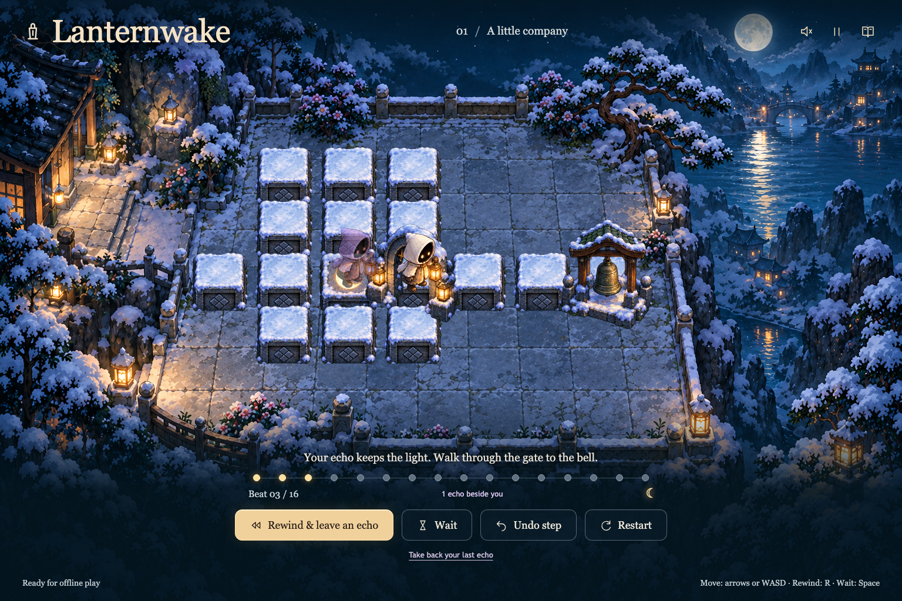

# Lanternwake

**Leave an echo. Become your own company.**

A small, illustrated browser puzzle about borrowing help from your past selves.
Walk onto a lantern pad, rewind, and your echo repeats that walk. It waits where
you left it while you take a different path. The first courtyard takes less than
a minute; later rooms need two or three echoes and a bridge with its own rhythm.



Four authored rooms, original generated winter artwork, keyboard and touch
controls, step undo, echo recovery, a journal with gentle hints, an optional
musical echo choir, local saves, and a versioned offline cache. No accounts, analytics,
AI requests, or remote gameplay services.

## Play locally

Requires Node.js 24+ and pnpm 12.8.1.

```sh
pnpm install --frozen-lockfile
pnpm build
pnpm start
```

Open **http://127.0.0.1:4317**. Development: `pnpm dev` at **https://lanternwake.localhost**, served through [Portless](https://github.com/vercel-labs/portless) (a dev dependency); its first run may ask for `sudo` to bind port 443 and trust a local certificate.
Offline caching is enabled in the production build. Wait for **Ready for offline
play** before disconnecting; reopen the same browser and origin. The local
server must stay running for a fresh uncached browser, but a previously cached
browser can reload without network access.

Move with arrow keys or WASD. **R** rewinds and leaves an echo, **Space** waits,
**Z** undoes one step, and **Escape** pauses/resumes. Mobile provides direction
buttons; a neighboring stone can also be clicked or tapped. Enable sound using
the upper-right sound button. Sound starts muted after each page load.

With sound enabled, stepping stones become notes. Each echo repeats your tune
in its own register and stereo position. Wait to hear moving echoes on their
own; resting echoes stay silent. [Hear a real two-echo solution](evidence/echo-choir.wav).

The clock moves only when you do. A blocked move costs no beat. Echoes repeat
recorded positions and hold their endpoint. The moon bridge is bright on beats
2–3 of each four-beat cycle; entering it uses the **next** beat. Standing on it
is safe when it dims. Reaching the bell requires every pad held simultaneously.

Use **Take back your last echo** to resume its recorded path, or **Restart** for
a fresh room. Opening the journal or moving the tab into the background pauses
the game. Foreground return needs a deliberate resume.

## Verification

```sh
pnpm check       # TypeScript + 15 deterministic unit/property tests
pnpm build      # Production assets + content-versioned offline cache
pnpm test:e2e   # Six full Chromium interaction tests, one worker
```

Install a browser only if it is absent: `pnpm exec playwright install chromium`.
All four room solutions run through actual keyboard input in browser tests.
The tests also cover touch controls, pause/reset/undo, echo recovery, sound
opt-in, validated saves, reduced motion, offline reload with artwork, and
keyboard focus/Escape behavior in pause and completion dialogs.
The audio test observes real oscillator pitches, gesture-only creation,
echo replay, mute/pause cleanup, and the limit on simultaneous voices.

[Gameplay clip](evidence/lanternwake-demo.webm) · [Mobile screenshot](evidence/mobile.png)
· [Research and concept comparison](docs/research.md) · [QA evidence](docs/verification.md)

## Structure

- `src/game/simulation.ts`: pure deterministic transition rules.
- `src/game/music.ts`: pure route-to-note composition; `audio.ts` synthesizes it locally.
- `src/game/levels.ts`: authored maps, dependencies, hints, and verified solutions.
- `src/game/renderer.ts`: Phaser scene, original atlas frames, movement tweens.
- `src/game/storage.ts`: save validation by replaying each stored path.
- `src/game/use-game.ts`: local persistence, lifecycle, and audio integration.
- `src/components/`: accessible DOM controls, timeline, journal, and world shell.
- `scripts/build-cache.mjs`: hashed service-worker cache generated from all build files.
- `scripts/serve.mjs`: dependency-free local/static HTTP server with `/health`.

## Hosting scaffold and limits

Dockerfile and `railway.toml` are provided for a future Railway deployment.
Nothing has been provisioned or deployed. The build is static and can also be
served by Cloudflare with a private access policy. Keep any future hosted demo
private; the prototype itself has no server authentication.

The scope is a short toy, not a full game: four rooms, no level editor, no cloud
sync, no real-time co-op, and no gamepad support. Chromium was verified;
Safari/Firefox and physical touch devices remain untested. Audio control and
context activation were tested, but its artistic balance still needs human
listening. The first load includes about 5.3 MiB of PNG artwork and a 1.44 MB
JavaScript bundle; subsequent offline play uses the cached files.

The time-loop mechanic has prior art. Lanternwake's experiment is its quiet,
turn-based, position-replay interpretation and atmosphere. See the research
brief rather than treating it as a new genre.
